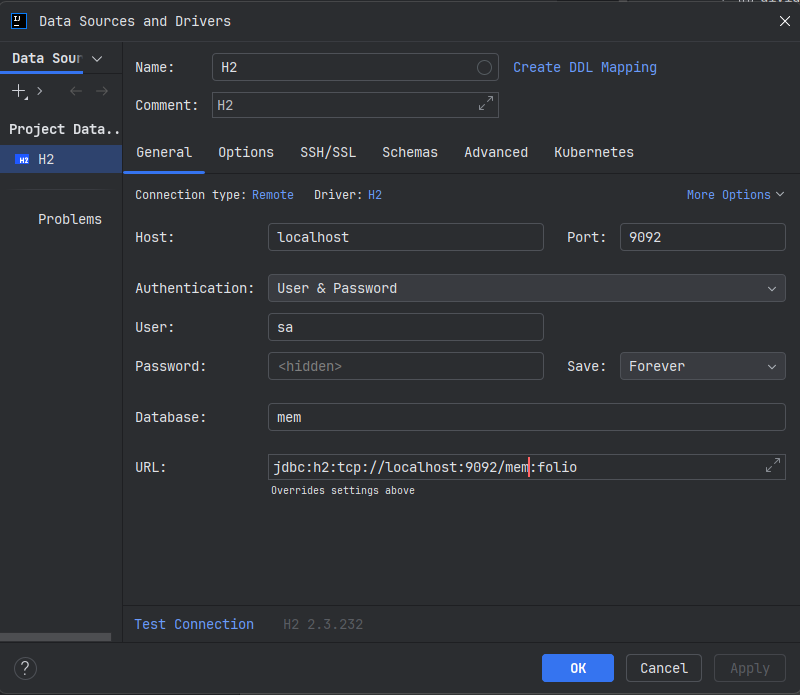

# Folio - Investment Portfolio Tracker

## Development Database Connection (H2)

When running in `dev` mode, the application uses an H2 in-memory database with TCP server enabled.

### H2 Console (Web UI)
Access the H2 Console at: **http://localhost:8080/h2-console**

### Connection Details
**Use these exact settings in the H2 Console:**

| Field | Value |
|-------|-------|
| **Saved Settings** | Generic H2 (Embedded) |
| **Setting Name** | Folio Dev |
| **Driver Class** | `org.h2.Driver` |
| **JDBC URL** | `jdbc:h2:tcp://localhost:9092/mem:folio` |
| **User Name** | `sa` |
| **Password** | (leave empty) |



> **⚠️ Important:** If the console is prefilled with incorrect values (e.g., username "dev" or URL containing "TLT"), these are from browser local storage. Simply **replace** them with the correct values above, then click "Connect". The H2 console will remember your last connection settings.

### Alternative: Direct JDBC Connection
You can also connect using any database tool (DBeaver, IntelliJ Database Tools, etc.):
```
jdbc:h2:tcp://localhost:9092/mem:folio
```

### Notes
- The H2 TCP server runs on port **9092**
- The application backend runs on port **8080**
- Database name: **folio**
- Database mode: PostgreSQL compatibility mode
